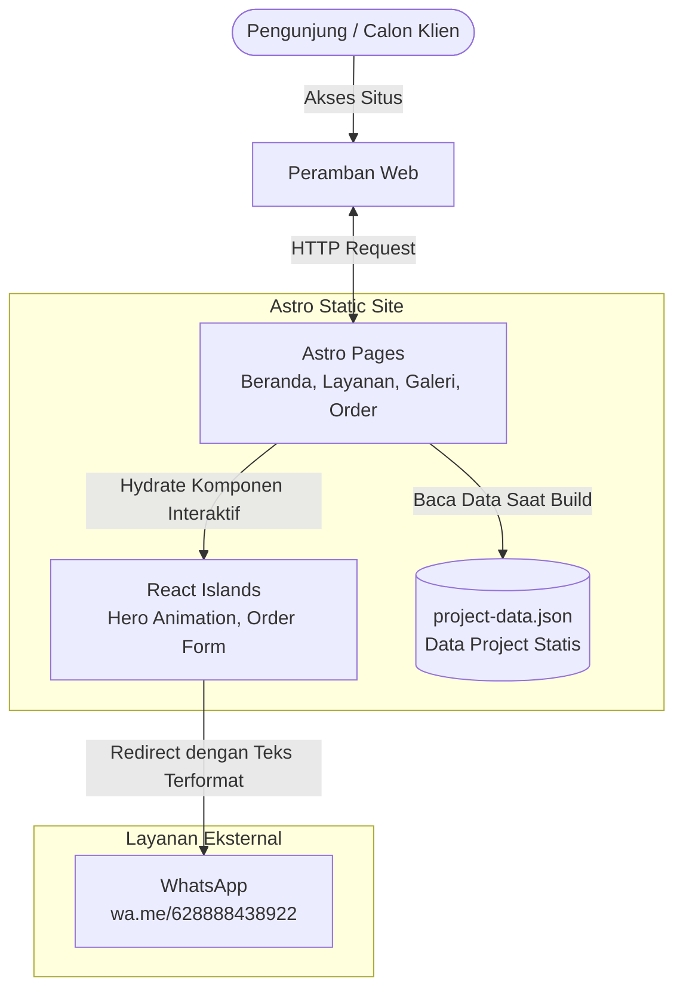
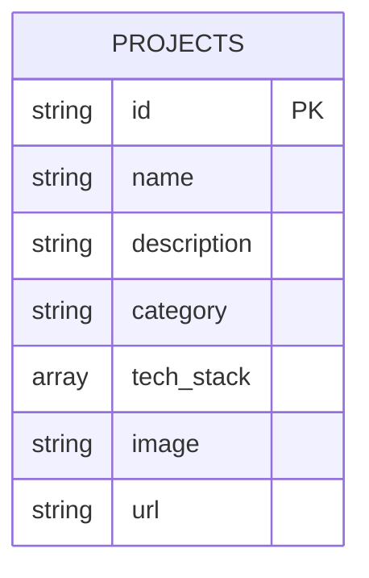

# PRD — Project Requirements Document

## 1. Overview
Aplikasi ini adalah **website portofolio & landing page bisnis** untuk domain **daryas.tech**, berfungsi sebagai etalase digital yang menampilkan kapabilitas pengembangan web dan menjadi kanal akuisisi klien. Masalah utama yang diselesaikan adalah ketiadaan presence digital yang meyakinkan untuk menjangkau calon klien korporat/UMKM menengah, serta tidak adanya jalur pemesanan yang ringkas dan langsung terhubung ke komunikasi personal (WhatsApp).

Dengan aplikasi ini, calon klien dapat memahami fokus layanan (pembuatan Website Internal Manajemen Perusahaan dan Website Retail Kelas Menengah), melihat bukti kerja melalui Galeri Project, lalu melakukan pemesanan — baik menduplikasi/menyesuaikan project yang sudah ada maupun memesan pengembangan custom — dengan aksi akhir berupa pesan WhatsApp otomatis yang sudah terstruktur.

**Design System & UI Direction**
Antarmuka mengusung tema **"Classic Meets Modern Interactive"** — tipografi dan palet warna klasik yang elegan dipadukan layout modern serta transisi animasi yang sangat halus. Tanpa elemen atau library 3D. Seluruh keputusan estetika (tipografi, palet, spacing, micro-interaction) diarahkan menggunakan **Taste Skill** (dari `tasteskill.dev`) sebagai lapisan kurasi desain di atas fondasi Tailwind CSS. Optimasi tampilan mengutamakan Desktop, dengan fondasi layout yang tetap mobile-responsive mengingat calon klien juga mengakses dari perangkat mobile.

> **Catatan lingkup:** Versi PRD ini berfokus pada empat halaman inti — Beranda, Layanan, Galeri Project, dan Pemesanan/Kontak — beserta fondasi teknis yang menjadi prasyaratnya (Setup Proyek & Design System). Galeri Project pada tahap ini bersifat **statis** (data JSON/array lokal, tanpa Admin Panel/CMS). Backend pemesanan (penyimpanan lead ke database, dashboard admin, CMS untuk project) berada di luar lingkup dokumen ini dan dapat direncanakan pada iterasi berikutnya.

## 2. Requirements
- **Estetika Klasik-Modern Terkurasi**: Seluruh komponen UI/UX harus dirancang dan dioptimalkan melalui Taste Skill (`tasteskill.dev`) dengan tema "Classic Meets Modern Interactive" — tipografi klasik elegan, layout modern, animasi halus, tanpa elemen 3D.
- **Dokumentasi Teknis Termutakhir via context7**: Sebelum implementasi dimulai, agent WAJIB mengambil dokumentasi terbaru ReactJS, Astro, dan Tailwind CSS melalui MCP `context7` agar kode yang dihasilkan sesuai API/konvensi versi terkini.
- **Arsitektur Astro Islands**: Situs dibangun di atas Astro sebagai kerangka utama (static-first, performan), dengan ReactJS dipakai selektif sebagai Astro Islands hanya pada komponen yang benar-benar interaktif (mis. Order Page).
- **Galeri Project Berbasis Data Statis**: Daftar project portofolio disimpan sebagai file JSON/array data di dalam kode (bukan database/CMS) agar mudah diperbarui manual pada tahap ini.
- **Alur Pemesanan Menuju WhatsApp**: Setiap pemesanan (baik memilih project lama maupun custom) berujung pada redirect ke WhatsApp (`https://wa.me/628888438922`) dengan teks pesan yang sudah terformat otomatis sesuai pilihan klien.
- **Referensi Konten Existing**: Teks, aset, dan struktur konten mengacu pada folder lokal `porto-daryas-main` sebagai sumber utama pengisian data halaman.

## 3. Core Features
Sesuai dengan kerangka fitur yang sudah direncanakan, seluruh pengembangan akan dibagi di dalam satu tahapan awal berikut:

### Fase 1
- **Setup Proyek & Design System** [high] — Fondasi teknis Astro + React + Tailwind beserta arahan estetika dari Taste Skill sebelum halaman-halaman dibangun.
  - *Riset Dokumentasi via context7* — Mengambil dokumentasi terbaru React, Astro, dan Tailwind CSS.
  - *Inisialisasi Proyek Astro* — Struktur folder, konfigurasi `astro.config.mjs` dengan integrasi React + Tailwind.
  - *Kurasi Desain via Taste Skill* — Menetapkan token desain (tipografi, palet warna, spacing, animasi) bertema "Classic Meets Modern Interactive".
- **Beranda (Home)** [high] — Halaman utama dengan hero section elegan dan ringkasan fokus bisnis.
  - *Hero Section Interaktif* — Tipografi elegan dengan animasi teks/layout menggunakan Framer Motion/GSAP.
  - *Ringkasan Fokus Bisnis* — Highlight singkat layanan Website Internal Manajemen Perusahaan & Website Retail, harga terjangkau, dan sifat end-to-end.
- **Layanan (Services)** [high] — Penjelasan rinci layanan end-to-end dari konsultasi hingga maintenance.
  - *Detail Alur Layanan End-to-End* — Menjabarkan tahapan konsultasi ide, desain, development, deployment, hingga maintenance harian.
  - *Penekanan Harga Terjangkau* — Menonjolkan value proposition harga terjangkau dibanding kompetitor/agency besar.
- **Galeri Project (Project Gallery)** [high] — Etalase portofolio project yang sudah pernah dibuat.
  - *Tampilan Grid/List Project* — Menampilkan daftar project dari data statis JSON/array lokal.
  - *Detail Project* — Ringkasan singkat tiap project (nama, deskripsi, teknologi, tautan/gambar bila ada).
- **Pemesanan / Kontak (Order Page)** [high] — Halaman interaktif untuk memulai proses pemesanan menuju WhatsApp.
  - *Pemilihan Jenis Pesanan* — Opsi Card interaktif: duplikasi/sesuaikan project existing vs custom baru.
  - *Form Detail Sederhana* — Input singkat sesuai jenis pesanan yang dipilih.
  - *Redirect Otomatis ke WhatsApp* — Tombol "Pesan Sekarang" membentuk teks terformat dan membuka `wa.me` dengan nomor tujuan yang sudah ditentukan.

## 4. User Flow
Berikut merupakan perjalanan skenario paling umum ketika pengunjung memakai situs.

1. **Kunjungan Awal (Pengunjung)**
   - Membuka Beranda, melihat hero section dengan animasi dan ringkasan fokus bisnis (Website Internal Manajemen Perusahaan & Website Retail Kelas Menengah).
   - Mengklik navigasi menuju Layanan atau Galeri Project untuk eksplorasi lebih lanjut.
2. **Eksplorasi Layanan**
   - Pengunjung membuka halaman Layanan dan membaca alur end-to-end (konsultasi → desain → development → deployment → maintenance) beserta penekanan harga terjangkau.
3. **Eksplorasi Galeri Project**
   - Pengunjung membuka Galeri Project, melihat daftar project yang sudah pernah dibuat (data statis) beserta ringkasan masing-masing.
   - Tertarik pada satu project tertentu untuk dijadikan basis pemesanan.
4. **Alur Pemesanan (Order Page)**
   - Pengunjung membuka halaman Pemesanan/Kontak.
   - Memilih salah satu opsi: (a) menduplikasi/menyesuaikan project dari Galeri, atau (b) memesan Website Custom baru.
   - Mengisi form detail sederhana sesuai pilihan (nama project yang diminati, atau kebutuhan singkat untuk custom).
   - Mengklik "Pesan Sekarang" — sistem menyusun teks WhatsApp otomatis sesuai pilihan dan membuka `https://wa.me/628888438922?text=...` di tab baru/redirect.
5. **Lanjutan di WhatsApp**
   - Percakapan lanjut terjadi di luar sistem (WhatsApp), di mana Daryas menindaklanjuti secara personal.

## 5. Architecture
Situs dibangun di atas arsitektur **static-first dengan Astro Islands** — sebagian besar halaman dirender statis pada build time untuk performa maksimal, sementara komponen interaktif (Order Page, animasi hero) di-hydrate sebagai island React secara selektif. Data project (Galeri) dibaca dari file JSON/array lokal saat build, tanpa lapisan backend/database pada tahap ini.

## 6. Data Schema
Karena tidak ada backend/database pada tahap ini, "skema data" yang relevan adalah struktur file JSON/array untuk Galeri Project.

### Struktur Data Utama
*   **projects** (Array/JSON, disimpan lokal di dalam kode — mis. `src/data/projects.json`)
    *   `id` (String/Slug unik)
    *   `name` (Nama project)
    *   `description` (Deskripsi singkat)
    *   `category` (Enum bebas: mis. 'Internal Management', 'Retail/E-commerce')
    *   `tech_stack` (Array string, mis. `['Laravel', 'Livewire', 'Tailwind']`)
    *   `image` (Path/URL gambar thumbnail)
    *   `url` (Opsional — tautan demo/live project bila tersedia)

## 7. Tech Stack
Sesuai dengan permintaan yang spesifik, proyek ini akan dikerjakan menggunakan kerangka berikut:

- **Framework Utama:** Astro (versi terbaru) — static-site generation, performa tinggi, Astro Islands untuk hidrasi selektif.
- **Frontend Interactivity:** ReactJS — dipakai sebagai Astro Island hanya pada komponen yang butuh state/interaktivitas (Order Page, elemen animasi hero).
- **Styling:** Tailwind CSS — utility-first, dikombinasikan dengan token desain hasil kurasi Taste Skill.
- **Animasi:** Framer Motion dan/atau GSAP — transisi halus pada hero section dan micro-interaction (tanpa elemen 3D).
- **Design Curation Layer:** Taste Skill (`tasteskill.dev`) — mengarahkan seluruh keputusan estetika UI/UX di atas fondasi Tailwind.
- **Documentation Research:** MCP `context7` — sumber dokumentasi terkini React, Astro, dan Tailwind CSS sebagai referensi implementasi sebelum coding dimulai.
- **Data Layer (Fase 1):** File JSON/array statis lokal (tanpa database/CMS) untuk Galeri Project.
- **Deployment:** Static hosting yang kompatibel dengan output Astro (mis. Vercel/Netlify/Cloudflare Pages) — domain akhir: **daryas.tech**.
